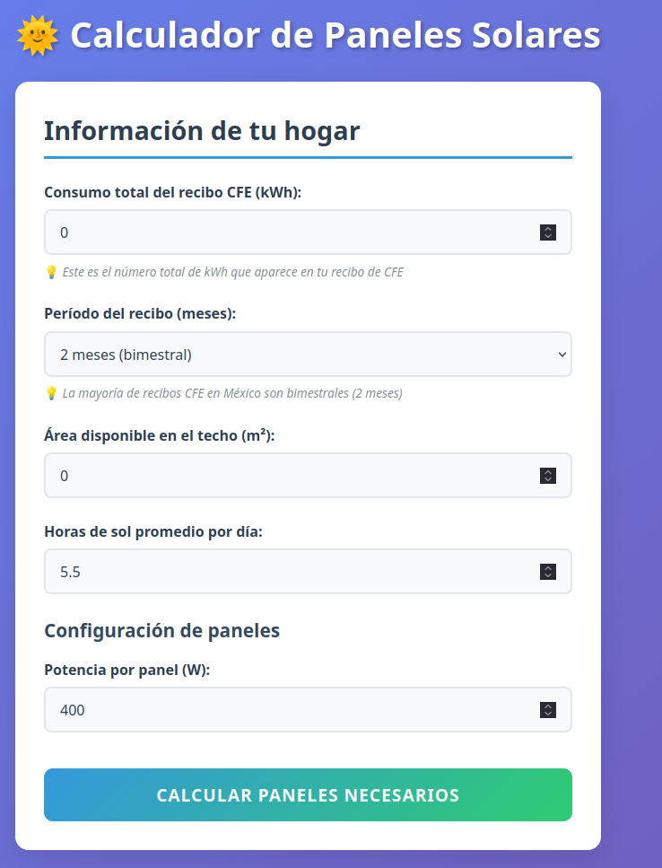

# 🌞 Calculador de Paneles Solares

Una aplicación web moderna y precisa para calcular cuántos paneles solares necesitas para tu hogar en México, considerando las particularidades de los recibos de CFE.

## 🚀 [**Acceder a la Aplicación**](https://hao.systems/paneles-solares/)

[](https://hao.systems/paneles-solares/)

## ✨ Características

### 📊 **Cálculo Preciso**
- **Fórmula científica**: Usa la fórmula `(P × l) / h` donde:
  - **P** = Consumo diario en kWh
  - **l** = Factor de pérdida (inversor, cables, etc.) - Default: 1.2
  - **h** = Horas solar pico por día - Default: 5 horas (México)
- **Cálculo en decimales**: Muestra el número exacto de paneles necesarios antes del redondeo
- **Potencia en Watts**: Resultados en Watts para mayor claridad
- **Entrada de 12 meses**: Captura de consumo bimestral, trimestral o semestral para precisión anual

### 🏠 **Adaptado para México**
- **Recibos CFE**: Diseñado específicamente para los recibos de la Comisión Federal de Electricidad
- **Múltiples períodos**: Soporta recibos de 1, 2, 3 o 6 meses
- **Paneles configurables**: Ajusta la potencia del panel (Default: 400W)
- **Validaciones inteligentes**: Detecta consumos atípicos (muy bajo <50 kWh/mes o muy alto >1000 kWh/mes)

### 📱 **Interfaz Moderna**
- **Responsive**: Funciona perfectamente en móviles, tablets y escritorio
- **Fácil de usar**: Interfaz intuitiva con guías paso a paso
- **Resultados claros**: Tarjetas visuales con 5 métricas clave
- **Consejo integrados**: Recomendaciones automáticas según el tamaño del sistema
- **Persistencia local**: Guarda automáticamente tus datos en localStorage si refrescas la página

## 🎯 **Cómo Usar**

1. **Selecciona el período del recibo** (1, 2, 3 o 6 meses)
2. **Ingresa el consumo kWh de cada período** durante los últimos 12 meses
3. **Ajusta los parámetros** (opcional):
   - **Horas solar pico**: Default 5 horas para México
   - **Factor de pérdida**: Default 1.2 (20% de pérdidas)
   - **Potencia por panel**: Default 400W
4. **Haz clic en "Calcular Paneles Necesarios"**
5. **¡Obtén tu resultado!** - Número exacto, recomendación y métricas de tu sistema

### 📹 **Video Tutorial**
[Ver video de ejemplo paso a paso](https://www.youtube.com/watch?v=cFAgnn2mwLk)

## 📈 **Ejemplo de Uso**

**Consumo bimestral durante 12 meses:**

```
Bimestre 1: 680 kWh
Bimestre 2: 720 kWh
Bimestre 3: 650 kWh
Bimestre 4: 700 kWh
Bimestre 5: 690 kWh
Bimestre 6: 710 kWh

Total anual: 4,150 kWh
Consumo diario: 11.37 kWh/día
```

**Con la fórmula (P × l) / h:**
- Potencia requerida = (11.37 × 1.2) / 5 = **2.73 kW**
- Paneles de 400W necesarios = 2,730W / 400W = **6.82 paneles**
- **Recomendación: 7 paneles de 400W**
- **Sistema total: 2,800 Watts**
- **Generación mensual: ~770 kWh/mes**

## 🛠 **Tecnologías**

- **React 19** con TypeScript
- **Vite** para desarrollo rápido
- **CSS moderno** con gradientes y animaciones
- **Responsive design** para todos los dispositivos
- **GitHub Pages** para hosting

## 🌱 **Resultados Calculados**

La aplicación calcula automáticamente:
- ✅ **Paneles exactos**: Número con decimales para cálculo preciso
- ✅ **Paneles recomendados**: Número redondeado hacia arriba (enteros)
- ⚡ **Potencia total del sistema**: En Watts
- 📊 **Generación mensual esperada**: En kWh/mes
- 🌱 **Reducción de CO₂ anual**: Kg de CO₂ evitados por año (factor: 0.5 kg CO₂/kWh)
- 📐 **Área requerida**: En metros cuadrados (2.2 m² por panel incluyendo espacios de ventilación)

## 🔬 **Fórmula de Cálculo**

La aplicación utiliza la siguiente fórmula para calcular la potencia fotovoltaica requerida:

```
Potencia Requerida (kW) = (Consumo Diario (kWh) × Factor de Pérdida) / Horas Solar Pico

Paneles Necesarios = Potencia Requerida (W) / Potencia por Panel (W)
```

### Parámetros Explicados:
- **Consumo Diario**: Consumo anual total ÷ 365 días
- **Factor de Pérdida**: Considera pérdidas en inversor, cableado, conexiones (default: 1.2 = 20% de pérdidas)
- **Horas Solar Pico**: Equivalente a radiación solar máxima en condiciones ideales (default: 5 horas para México)
- **Potencia por Panel**: Típicamente 400W en el mercado actual (configurable)

## 🇲🇽 **Diseñado para México**

Esta herramienta está específicamente optimizada para:
- Recibos de CFE (bimestrales principalmente)
- Condiciones de radiación solar mexicana
- Factores de eficiencia locales
- Tarifas y patrones de consumo típicos

## 📞 **Contribuir**

¿Tienes sugerencias o mejoras? ¡Las contribuciones son bienvenidas!

---

**[🌞 Calcular mis paneles solares →](https://hao.systems/paneles-solares/)**
